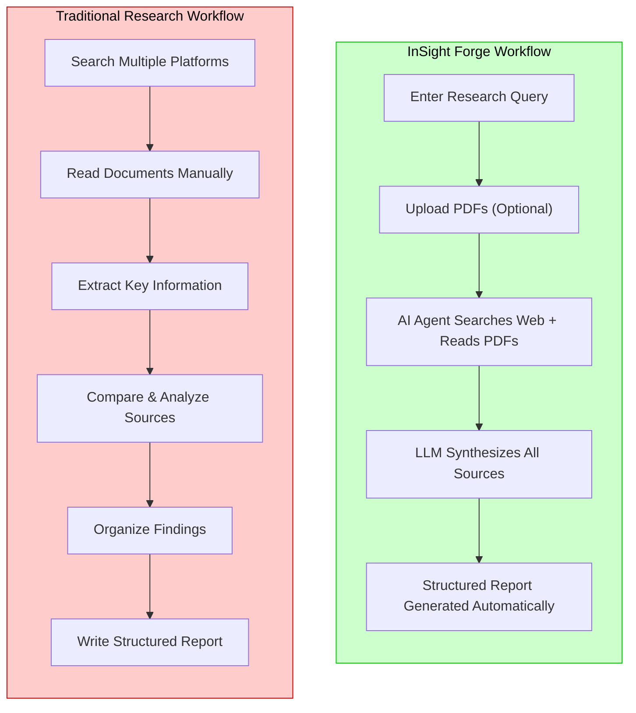
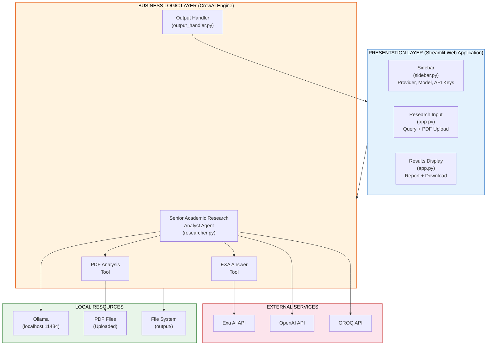
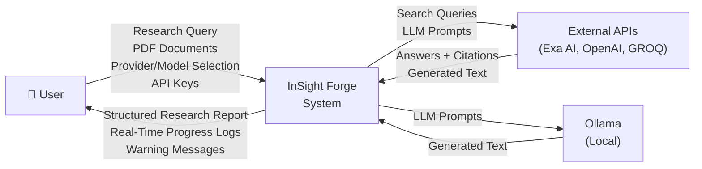
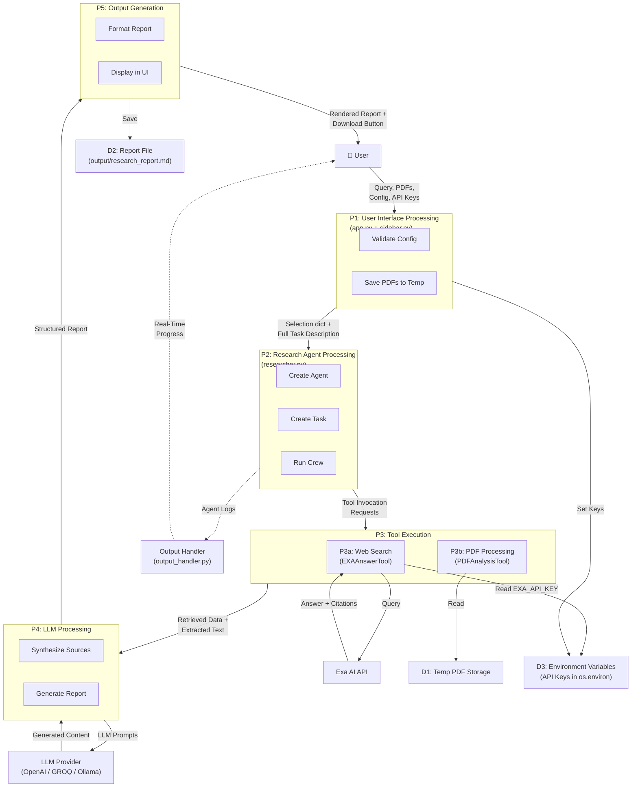
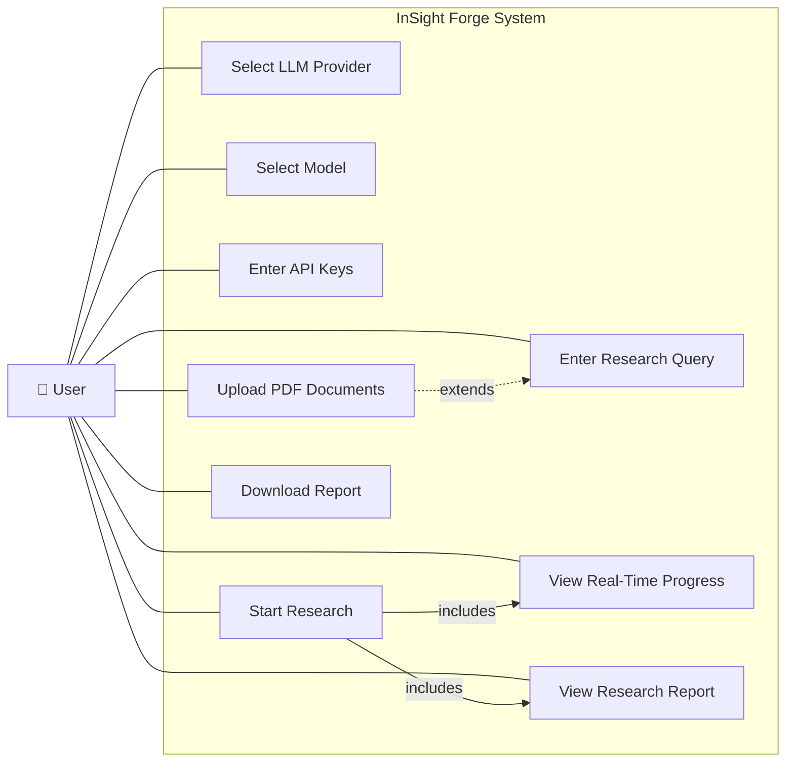
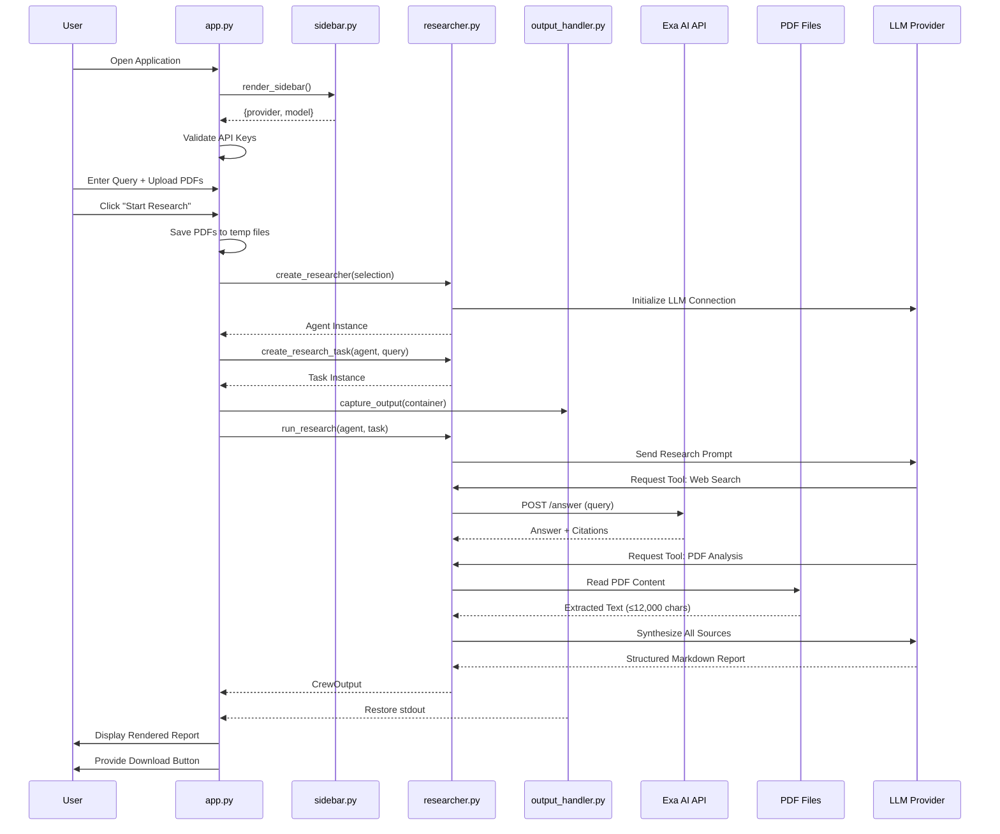
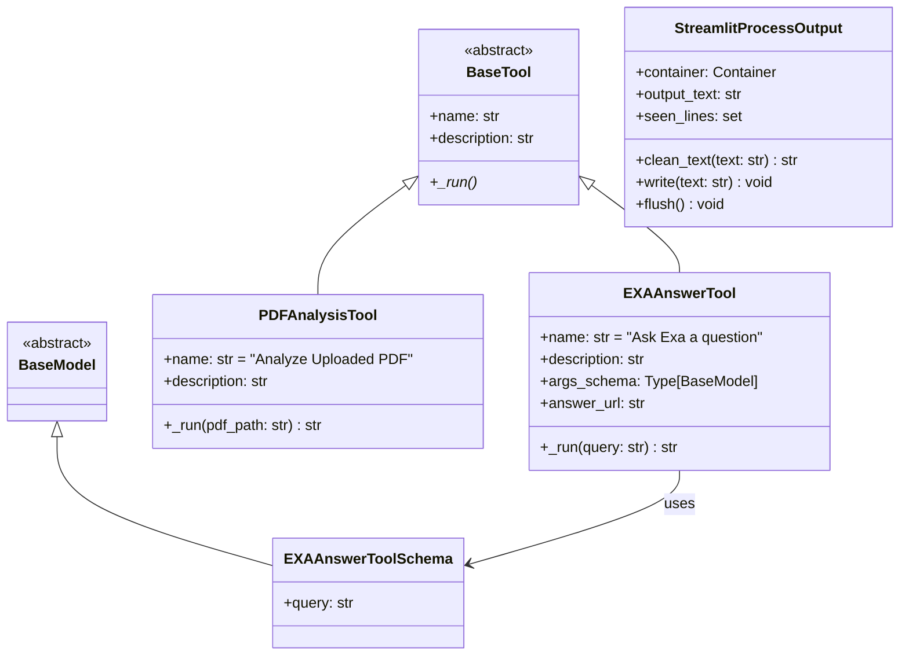
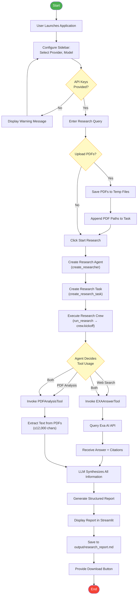
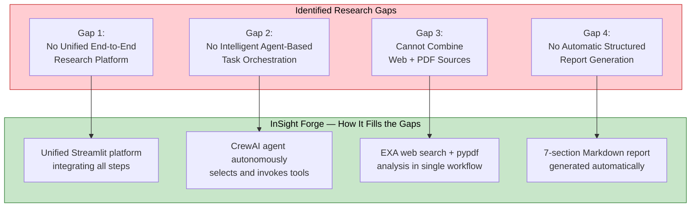

# All Mermaid Diagrams — InSight Forge Report

Render each diagram at [mermaid.live](https://mermaid.live), export as PNG/SVG, and insert into your Word/Google Docs report at the corresponding `[INSERT DIAGRAM]` placeholder.

---

## Figure 1.1 — Traditional vs AI-Assisted Research Workflow (Chapter 1)

**Note:** If Mermaid side-by-side doesn't render well, draw this as two parallel vertical flowcharts in draw.io: left side (red-tinted, 6 manual steps) and right side (green-tinted, 5 automated steps) with a "Weeks" label on left and "Minutes" label on right.

---

## Figure 4.1 — System Architecture (Chapter 4, §4.2)

---

## Figure 4.2 — Level 0 DFD / Context Diagram (Chapter 4, §4.4.1)

---

## Figure 4.3 — Level 1 DFD (Chapter 4, §4.4.2)

---

## Figure 4.4 — Use Case Diagram (Chapter 4, §4.5.1)

**Note for draw.io:** If you prefer a proper UML Use Case diagram, draw the system boundary as a rectangle, place use case ovals inside, and the stick-figure actor outside with lines connecting to each use case. Add `<<include>>` arrows from "Start Research" to "View Real-Time Progress" and "View Research Report." Add a `<<extend>>` arrow from "Upload PDF Documents" to "Enter Research Query."

---

## Figure 4.5 — Sequence Diagram (Chapter 4, §4.5.2)

---

## Figure 4.6 — Class Diagram (Chapter 4, §4.5.3)

---

## Figure 4.7 — System Flowchart (Chapter 4, §4.6)

---

## Figure 2.1 — Comparison of Existing Systems (Chapter 2)

This is best done as a **table in your Word document** rather than a Mermaid diagram. Use the following content:

| Feature | Google Scholar | ChatGPT | Perplexity AI | Semantic Scholar | InSight Forge |
|---|---|---|---|---|---|
| Web Search | ✓ (keyword) | ✓ (Google/Bing) | ✓ (built-in) | ✓ (academic) | ✓ (Exa Neural) |
| PDF Analysis | ✗ | ✓ (upload) | ✗ | ✗ | ✓ (multi-PDF) |
| Structured Report | ✗ | Requires prompting | ✗ | ✗ | ✓ (automatic 7-section) |
| Real Citations | ✓ | Improving | ✓ | ✓ | ✓ (Exa verified) |
| Offline Mode | ✗ | ✗ | ✗ | ✗ | ✓ (Ollama) |
| Multi-Provider LLM | ✗ | ✗ (OpenAI only) | ✗ | ✗ | ✓ (OpenAI/GROQ/Ollama) |
| Real-Time Progress | ✗ | Partial (thinking) | ✗ | ✗ | ✓ (live agent logs) |
| Automated Workflow | ✗ | Requires prompts | Partial | ✗ | ✓ (fully agentic) |
| Open Source | ✗ | ✗ | ✗ | ✗ | ✓ |
| Cost | Free search | $20/month+ | Free/Paid | Free | Pay-per-use / Free |

---

## Figure 2.2 — Research Gap Visualization (Chapter 2)

